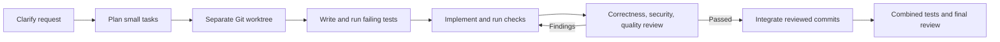

# Deliberate Dev for Claude Code

**Turn a rough software idea into clear requirements, small tasks, and tested, reviewed changes.**

[](https://github.com/Zaheer-verse/deliberate-dev-claude/actions/workflows/ci.yml)
[](https://github.com/Zaheer-verse/deliberate-dev-claude/releases)
[](LICENSE)

[Quick start](#quick-start) · [Workflow](#workflow) · [Skills](#six-skills) · [Contributing](CONTRIBUTING.md) · [Codex edition](https://github.com/Zaheer-verse/deliberate-dev-codex)

Deliberate Dev gives Claude Code a repeatable software-delivery process. It turns unclear requests into a shared brief, maps work into small tasks, requires tests before implementation, separates tasks in Git worktrees, and records review before delivery.

The plugin has six skills and two local Python helpers. It uses Git and Python's standard library; it needs no API key, server, or third-party Python package.

## Quick start

Add this repository as a Claude Code marketplace, then install the plugin:

```text
/plugin marketplace add Zaheer-verse/deliberate-dev-claude
/plugin install deliberate-dev@deliberate-dev-claude
```

Start a new Claude Code session in your software project and enter:

```text
/deliberate-dev:deliberate-dev Build a booking system for a tutoring business.
```

The main skill coordinates the other five, and asks focused questions about **what**, **why**, and **who** whenever material answers are missing.

To try a downloaded release or local clone for one session, run Claude Code from your project directory:

```sh
claude --plugin-dir "/absolute/path/to/deliberate-dev-claude"
```

Local loading differs from marketplace installation: it only applies to that launch. Publishing this repository does not place the plugin in an official curated directory. See the [Claude Code plugin guide](https://code.claude.com/docs/en/plugins) and [marketplace guide](https://code.claude.com/docs/en/plugin-marketplaces) for current instructions.

## Workflow



Every task maps to acceptance criteria, owns a defined scope, and begins from an explicit Git baseline. Dependent tasks start from reviewed prerequisite revisions.

## Six skills

| Skill | Purpose |
| --- | --- |
| `deliberate-dev` | Coordinates the full workflow and final integration gate |
| `clarify-request` | Turns an idea into a brief and observable acceptance criteria |
| `plan-tasks` | Splits requirements into small tasks with dependencies and ownership |
| `test-first` | Guides red, green, refactor and records actual test evidence |
| `isolated-worktrees` | Plans or creates a separate branch and checkout for each task |
| `review-delivery` | Reviews correctness, security, and quality before delivery |

Invoke an individual skill with `/deliberate-dev:clarify-request` (substitute the desired skill name).

## Example

**Request:** “Build a booking system.”

Discovery establishes who books, whether cancellations are allowed, and which timezone controls availability. A resulting requirement might say: customers reserve tutoring slots, a tutor cannot receive overlapping bookings, and cancellation reopens a slot.

| Task | Test written first |
| --- | --- |
| Define availability | Overlapping intervals are rejected; adjacent slots are allowed |
| Reserve a slot | Two requests cannot both reserve the same slot |
| Cancel a booking | Cancelling an active booking makes its slot available |

Each task runs in its own worktree. Combined checks run after reviewed commits are integrated.

## Requirements and checks

- Claude Code with plugin support and access to the target project.
- Python 3.10+, Git 2.36+, and the project's test tools.
- A Git repository with a committed baseline, clean checkout, and writable sibling directory for worktrees and private run records.

```sh
claude plugin validate .
python -m unittest discover -s tests -v
python scripts/workflow.py check examples/plan.json --stage plan
```

`workflow.py` checks a coordinator's evidence record. `worktrees.py` defaults to a dry run; pass `--apply` only after inspecting the plan. Read [workflow format](docs/workflow-format.md), [worktree CLI](docs/worktrees-cli.md), and the [brief](skills/deliberate-dev/assets/brief.md), [task](skills/deliberate-dev/assets/task.md), and [review](skills/deliberate-dev/assets/review.md) templates.

## Boundaries

Skills guide an agent; they cannot enforce every edit or guarantee compliance. The evidence checker validates record structure and consistency, not the truth of claimed command output. Compare records against real Git state and test output.

Independent review requires subagents. When unavailable, the agent performs sequential role passes and should disclose self-review. The plugin does not guarantee secure application code, merge or deploy changes, or replace host permission controls.

See [CONTRIBUTING.md](CONTRIBUTING.md), [SECURITY.md](SECURITY.md), [CHANGELOG.md](CHANGELOG.md), and [LICENSE](LICENSE). This is an independent community project, not an official Anthropic plugin.
